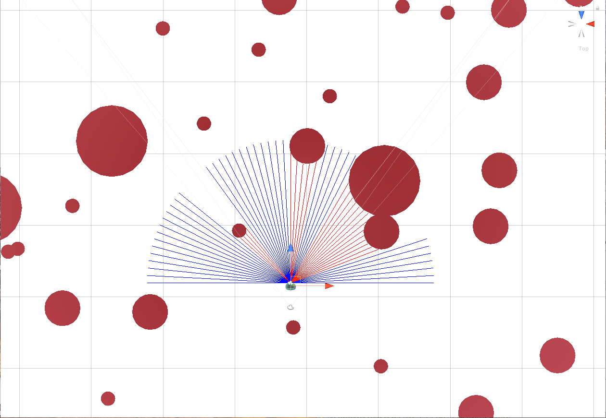

# Fixed-Wing UAV Obstacles Avoidance with Deep Q-Learning
This project is my 3rd Year dissertation for BEng Mechanical Engineering at the University of Manchester. The video showing the learning progress and final result of the agent is available at: https://youtu.be/c152DPwpyEU

## Project Description
This project implements Deep Q-Learning into one of the most heavily researched tasks in automation, obstacles avoidance. The environment and the UAV itself are simulated in Unity3D, while the DQL algorithm is written Python. The action of the UAV is constrained into only turning left, right, and going straight. That means its movement is limited to a 2D horizontal plane, very similar to a car. However, the UAV also roll while it's turining, just like a normal plane that needs to roll in order to turn. Thus, the environment is still in 3D. 

The goal of the agent is to fly in the forest of obstacles for a certain period of time. To prevent the agent from circling around, target point is introduced for the agent to fly to. This target point is NOT for the agent to reach, but only to guide the UAV into one particular direction. 

The agent will recieve a reward of +1 for every time step that it gets closer to the target point. However, if it flies further away from the target point at any time step, it will be given a reward of -1. If the agent crashes, it will get -1 reward, regardless of its flight direction. The reason for such a simple reward is to increase the stability in learning of the agent. This is called "reward clipping".

There are 2 types of input that are used in this project:
 
1. LiDAR
  - simulated by using raycasts in Unity
  - produce only 2D input
  - wide field of view [-90° , 90°] horizontally
        
2. Depth image
  - mimicking the use of depth estimation algorithm with monocular camera
  - simulated using depth rendering in Unity
  - produce 3D input 
  - narrow field of view [-30° , 30°] horizontally & vertically
  - 0.1s time delay at each time step (mimick the slow computational time of depth estimation algorithm)
  
As you can see, each input has pros and cons. This project will conduct the experiment with each input and assess the effect of their characteristics on the agent's performance in avoiding obstacles. 

        

